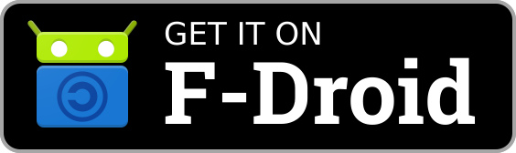

 

    

 

  No-nonsense noise app for focus, sleep, study, and relaxation.

 

    
    

    
    

    
    

---

## What is Metiq?

Metiq plays high-quality **colored noise** — pink, brown, white, and grey — alongside **binaural beats** and a set of relaxing **ambient sounds**, to help you focus, study, meditate, fall asleep, or just block out the world.

Open it, tap, listen. That's the whole app.

It's **fully offline** — audio is bundled, so there's no streaming, no account, and no internet permission. **No ads, no tracking, no analytics, no third-party SDKs.** Built to be native on each platform it lands on, and light on your battery.

## Highlights

- 🎧 **Four colored noises + six ambient sounds** — seamless, gapless loops
- 🧠 **Binaural beats** — five brainwave bands (delta to gamma) layered under any sound
- 🎚️ **Mix your own** — layer ambient sounds at independent levels and save presets
- 🌡️ **Warmth control** — roll off harsh highs to soften the colored noise
- ⏲️ **Sleep timer** — quick presets or custom hours / minutes / seconds
- 🔒 **Private by default** — offline, no accounts, no tracking, no ads
- 🔋 **Featherweight** — hardware-mixed audio, tiny footprint, minimal battery
- 🌍 **Seven languages** — English, Italian, Spanish, French, Portuguese, Polish, Chinese (Simplified)

## Get it

| Platform    | Where                                                                                                                                                                                                        |
| ----------- | ------------------------------------------------------------------------------------------------------------------------------------------------------------------------------------------------------------ |
| **Android** | [F-Droid](https://f-droid.org/packages/xyz.metiq) · [Google Play](https://play.google.com/store/apps/details?id=xyz.metiq) · direct APK on each [release](https://github.com/metiq-xyz/android-app/releases) |

Android 9 (API 28) and newer.

## Projects

- **[android-app](https://github.com/metiq-xyz/android-app)** — the Android client, Kotlin + Jetpack Compose. `GPL-3.0`
- **[colored-noise-generator](https://github.com/metiq-xyz/colored-noise-generator)** — simple JS project to render, normalize and encode the colored noise files used in the app. `GPL-3.0`

## Support

Metiq is free and open source, and it stays that way. If it helps you or you like it, you can donate:

- ☕ [Ko-fi](https://ko-fi.com/metiq)
- 💜 [GitHub Sponsors](https://github.com/sponsors/metiq-xyz)

## License

Everything here is **[GPL-3.0-or-later](https://www.gnu.org/licenses/gpl-3.0.html)**. Use it, study it, share it, improve it.
